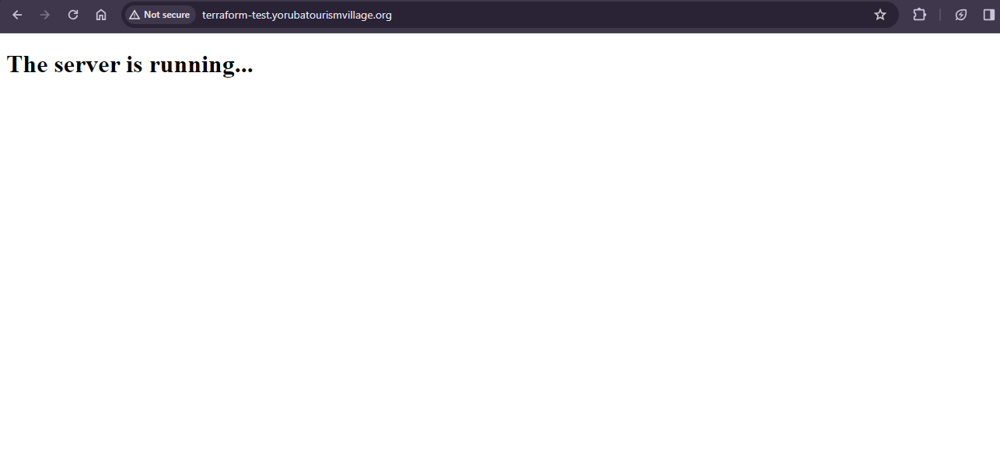

## Result of the terraform and ansible task
For this task I made use of GCP not AWS as instructed below. Kindly click [here](https://youtu.be/_Ar8qjs-n0s) to watch the live demo.

- Using Terraform, create 3 EC2 instances and put them behind an Elastic Load Balancer
- Make sure the after applying your plan, Terraform exports the public IP addresses of the 3 instances to a file called host-inventory
- Get a .com.ng or any other domain name for yourself (be creative, this will be a domain you can keep using) and set it up with AWS Route53 within your terraform plan, then add an A record for subdomain terraform-test that points to your ELB IP address.
- Create an Ansible script that uses the host-inventory file Terraform created to install Apache, set timezone to Africa/Lagos and displays a simple HTML page that displays content to clearly identify on all 3 EC2 instances.
- Your project is complete when one visits terraform-test.yoursdmain.com and it shows the content from your instances, while rotating between the servers as your refresh to display their unique content.
- Submit both the Ansible and Terraform files created

Kindly click below to access the terraform files
- [main](./main.tf)
- [provider](./provider.tf)
- [variables](./variables.tf)
- [output](./output.tf)

Also click [here](./apache.yml) to acess the ansible file

