## Linux commands
- Dispaly linux system info
```
uname -a
```
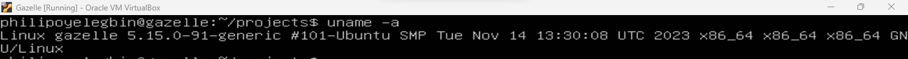

- show how long the sytem is running
```
uptime
```
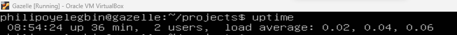

- show system reboot history
```
last reboot
```
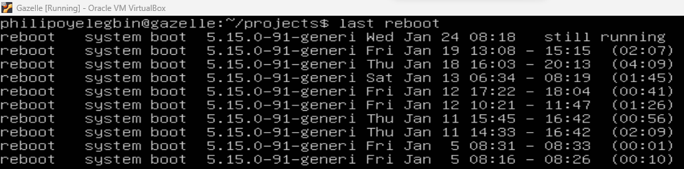

- who am i loggedin as
```
whoami
```
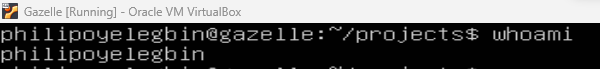

- who is online
```
w
```
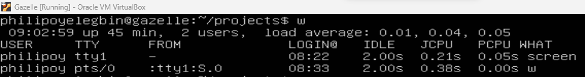

- show the filepath of the binary
```
which bash
```
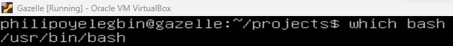

- display free and used memory
```
free -h
```
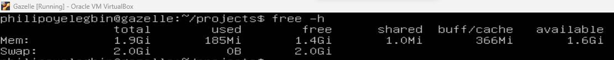

- show info about disk sda
```
hdparm -i /dev/sda
```
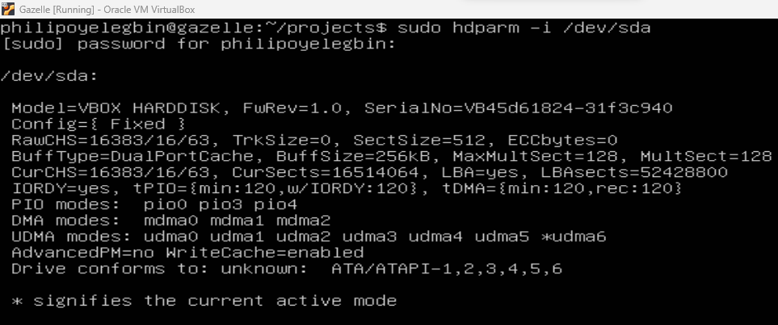

- perform read test on disk sda
```
hdparm -tT /dev/sda
```
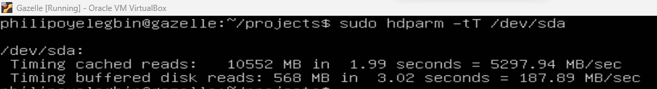

- dispaly listening tcp and udp port
```
netstat -nutlp
```
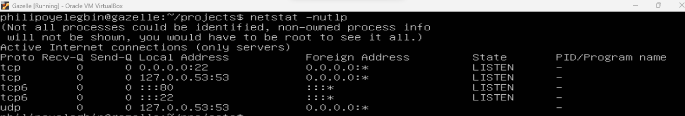

- display dns info for domain
```
dig philipoyelegbin.github.io
```
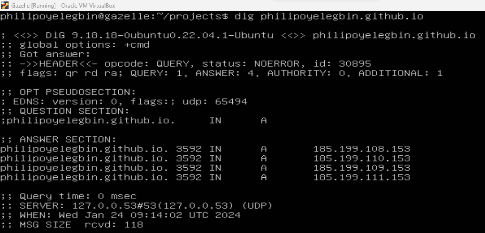

- reverse lookuo for IP addresses
```
dig -x 185.199.108.153
```
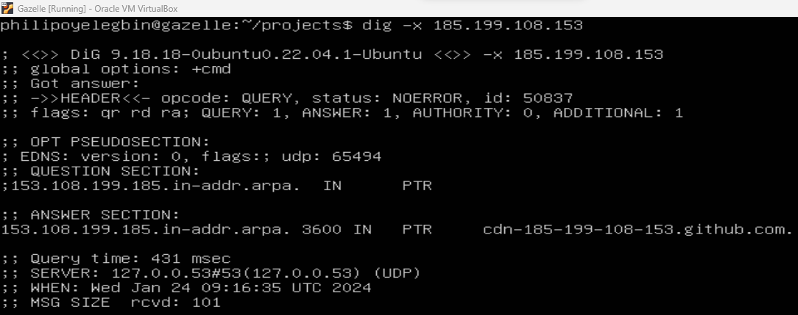
