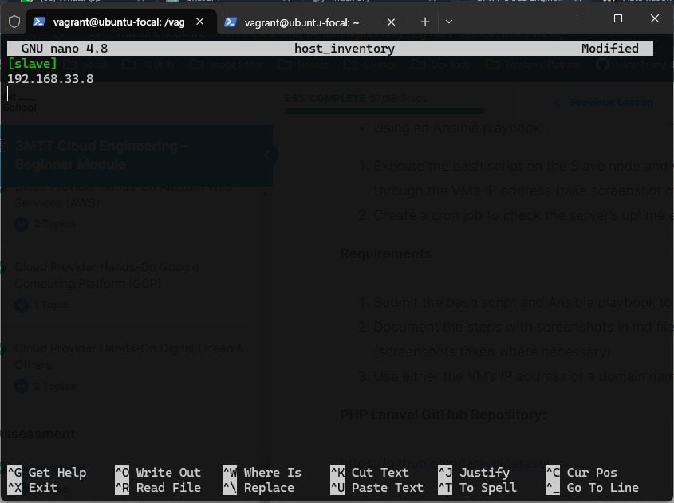
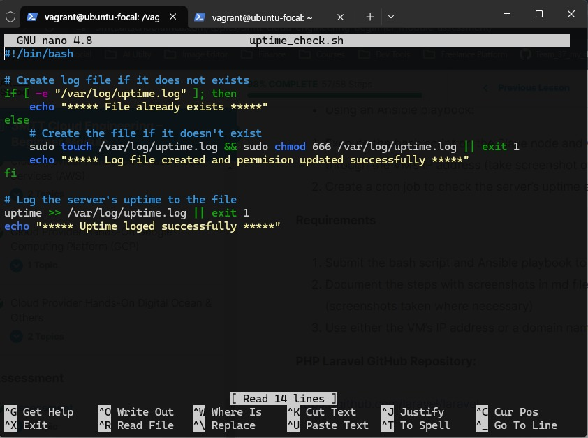
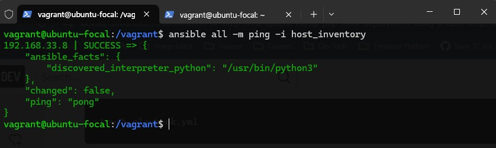
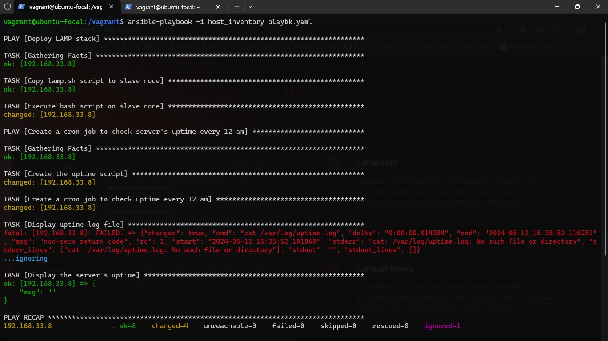
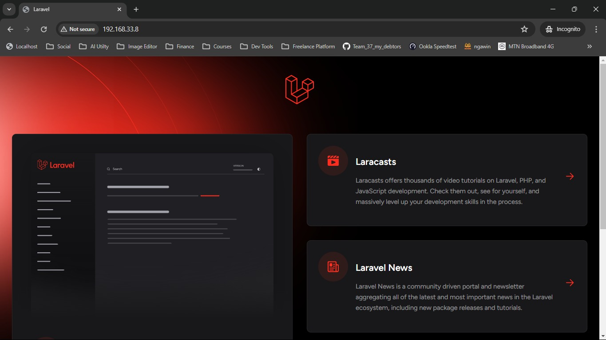

## Beginner Final Assessment

- I successfully set up a secondary Vagrant server, often referred to as a slave server. The IP address of this server has been added to my [host_inventory](host_inventory) file. You can see the setup in the image below:

- I have a bash script, [uptime bash](uptime.sh), that logs uptime. This script is executed when the cron job is triggered. The log file generated by this script can be seen in the following image:

- Prior to executing my Ansible [playbook](playbook.yml), I decided to perform a ping operation on the slave node. This was done using the host inventory file from the master node.

- I ran the Ansible playbook which executed the [lamp](lamp.sh) bash script and it executed successfully. The successful execution can be seen in the image below:

- After the successful execution of the playbook, I accessed the slave node via a web browser. The node was up and running as expected. You can see the result in the image below:

